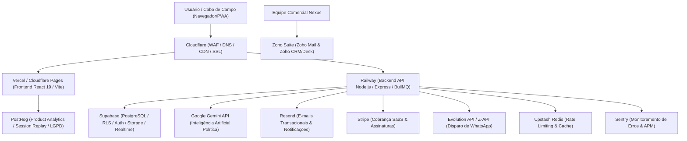
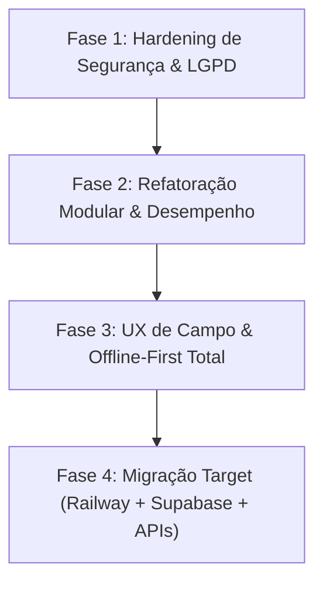

# 🦅 RELATÓRIO ESTRATÉGICO DE AUDITORIA & ARQUITETURA
## NEXUS POLÍTICA / SISTEMA ÁGUIA (2026)
> **Análise Técnica de Segurança, Usabilidade, Tecnologias e Roadmap de Melhorias**  
> **Status:** Análise Concluída | **Modificações em Código Fonte:** Nenhuma (Modo Leitura/Auditoria)  
> **Domínio Analisado:** `https://www.nexuspolitica.com.br/`  
> **Repositório Local:** `d:\FULLSTARK\Sistema-guia`

---

## 📋 SUMÁRIO EXECUTIVO

O **Nexus Política / Sistema Águia** é uma solução web de alta relevância estratégica voltada à coordenação eleitoral, inteligência territorial, controle financeiro de campanha e gestão de lideranças de campo (cabos eleitorais). 

Após uma varredura completa no site em produção (`https://www.nexuspolitica.com.br/`) e no código-fonte local (`Sistema-guia`), identificamos um ecossistema com **excelente proposta de valor funcional e riqueza de recursos**, porém apresentando **vulnerabilidades críticas de segurança no banco de dados**, **gargalos de manutenibilidade por arquivos monolíticos** e **oportunidades decisivas de otimização para usabilidade mobile em zonas de sombra de sinal**.

Este documento apresenta o diagnóstico detalhado divididos em 5 eixos principais, seguidos por um **Plano Estratégico de Implementação em 4 Fases** e a **Especificação de Arquitetura Target Enterprise**.

---

## 🛡️ 1. VARREDURA DE SEGURANÇA & CONFORMIDADE LGPD

### 🚨 Vulnerabilidades Críticas Encontradas

#### 1.1 Brecha Grave de Leitura Pública no Firestore (`firestore.rules`)
*   **Diagnóstico:** As regras de segurança atuais no arquivo `firestore.rules` concedem acesso de leitura irrestrito a qualquer visitante anônimo para dados confidenciais:
    ```json
    match /users/{userId} { allow read: if true; }
    match /settings/{settingId} { allow read: if true; }
    match /teams/{teamId} { allow read: if true; }
    match /voters/{voterId} { allow read: if true; allow create: if true; }
    ```
*   **Risco Real:** Qualquer pessoa na internet que inspecione a chave pública do Firebase no bundle JS da `nexuspolitica.com.br` pode realizar consultas REST ou SDK e **extrair toda a base de eleitores, telefones, endereços, redes de influência e dados de lideranças**, configurando vazamento massivo de PII.
*   **Risco de Injeção de Dados:** A regra `allow create: if true;` em `/voters/{voterId}` permite que atacantes injetem milhares de registros falsos (Resource Poisoning) sem qualquer autenticação.

#### 1.2 Ausência de Controle de Acesso Baseado em Funções (RBAC) no Banco
*   **Diagnóstico:** Para as coleções protegidas, a regra utilizada é genérica:
    ```json
    match /transactions/{id} { allow read, write: if isSignedIn(); }
    match /urgencies/{id} { allow read, write: if isSignedIn(); }
    ```
*   **Risco Real:** O controle de permissões (Diferença entre **Administrador**, **Coordenador** e **Líder de Equipe/Cabo**) é feito **apenas na interface React (Client-Side)**. Qualquer usuário autenticado (como um Cabo de Eleitor com conta no sistema) pode disparar requisições diretas para alterar transações financeiras, aprovar seus próprios pedidos de combustível, alterar dados da campanha ou deletar notas estratégicas.

#### 1.3 Riscos de Conformidade com a LGPD (Lei Geral de Proteção de Dados)
*   **Ausência de Criptografia de Campo / Mascaramento:** Dados sensíveis de eleitores (Título de Eleitor, Seção, Zona, foto, geolocalização e sentimento político) são armazenados em texto plano sem mascaramento ou logs de auditoria de consulta.
*   **Falta de Consentimento e Governança de Exclusão:** O cadastro público de eleitor (`PublicVoterRegister.tsx`) não exibe termos explícitos de aceite da LGPD nem política de privacidade configurável.

#### 1.4 Segurança do Servidor Node/Express (`server.ts`)
*   **Falta de Headers de Segurança HTTP:** O servidor não implementa cabeçalhos defensivos como `Content-Security-Policy` (CSP), `X-Frame-Options` (proteção contra Clickjacking), `X-Content-Type-Options` e `Strict-Transport-Security` (HSTS).
*   **Downloads sem Validação Estrita de Caminho:** A rota `/download/arquitetura-doc` utiliza concatenação de caminhos que deve ser rigidamente tratada contra *Path Traversal*.

---

## 🎨 2. VARREDURA DE USABILIDADE & EXPERIÊNCIA DO USUÁRIO (UX/UI)

### 📊 Diagnóstico de Usabilidade

| Elemento | Status Atual | Diagnóstico & Impacto no Usuário |
| :--- | :--- | :--- |
| **Responsividade Mobile** | ⚠️ Parcial | O painel do Cabo (`CaboDashboard.tsx`) possui boa intenção mobile, mas tabelas financeiras e gráficos complexos de D3/Recharts causam rolagem horizontal e overflow em telas de smartphones de 5.5". |
| **Experiência Offline (Campo)** | 🟡 Intermediário | O Firestore IndexedDB está habilitado em `firebase.ts`, mas a interface **não exibe feedback visual claro** quando o cabo entra em zona sem sinal (ex: "Você está offline - 4 cadastros salvos localmente"). |
| **Arquivos Monolíticos (Lag de UI)** | 🚨 Crítico | O `CoordinatorDashboard.tsx` possui **396 KB (~8.000 linhas)** e o `CaboDashboard.tsx` possui **191 KB**. Alterar qualquer estado recalcula a árvore de renderização inteira, causando lentidão no toque mobile. |
| **Acessibilidade (a11y)** | ⚠️ Deficiente | Modais (`DocDownloadModal`, `WhatsAppDispatchModal`, `SupabaseConfigModal`) carecem de atributos `aria-dialog`, foco preso (focus trap) e fechamento universal via tecla `ESC`. |
| **Formulários e Feedback Visual** | 🟢 Bom | Boas animações com `motion` e componentes visualmente atraentes, mas faltam estados de carregamento tipo *Skeleton Screens* durante chamadas assíncronas ao banco. |

---

## ⚡ 3. VARREDURA DE TECNOLOGIAS & ARQUITETURA DE CÓDIGO

### 🛠️ Stack Tecnológico Atual
*   **Frontend Core:** React 19 + Vite 6 + TypeScript 5.8.
*   **Estilização:** Tailwind CSS v4 + Motion (Framer Motion v12) + Lucide React icons.
*   **Banco de Dados & Auth:** Firebase Firestore v12 (Cliente) + Supabase JS v2 (Integração Híbrida).
*   **Servidor Backend:** Node.js + Express 4 + tsx (Atuando como servidor de desenvolvimento, proxy de Open Graph e entrega de arquivos).
*   **Visualização & Documentos:** D3.js + Recharts + XLSX (SheetJS) + jsPDF + docx.
*   **Módulo de Inteligência:** `geminiService.ts` convertido em motor determinístico local por palavras-chave (otimização de custo/sem dependência de API paga).

### 🔍 Oportunidades de Arquitetura Técnica

1. **Ausência de Gerenciador de Estado Global Estruturado:**
   * O sistema utiliza múltiplos estados locais `useState` elevados a níveis superiores com prop-drilling intenso, somados a chamadas diretas de `onSnapshot` espalhadas nos componentes de visualização.
   * **Recomendação:** Adotar **Zustand** para centralizar a store da campanha, autenticação e estados offline.

2. **Bundle Size & Carregamento Inicial:**
   * Bibliotecas pesadas como `jspdf`, `xlsx`, `d3`, e `docx` estão sendo importadas de forma síncrona no topo dos arquivos principais. Isso infla o tamanho do bundle inicial distribuído ao navegador.
   * **Recomendação:** Aplicar *Dynamic Imports* (`import()`) sob demanda apenas quando o usuário clicar em "Exportar PDF" ou "Gerar Excel".

3. **Arquitetura de Integração Híbrida (Firebase + Supabase + Asaas):**
   * O projeto possui conectores para Firebase e Supabase convivendo paralelamente (`firebase.ts`, `supabase.ts`, `asaasConfig.ts`). Falta definir claramente qual é o banco primário da aplicação (Single Source of Truth) para evitar inconsistência de dados entre cadastros.

---

## 🏛️ 4. ARQUITETURA TARGET RECOMENDADA (ENTERPRISE ECOSYSTEM)

Para garantir **escalabilidade comercial como SaaS**, **segurança absoluta LGPD**, **alta disponibilidade** e **inteligência artificial avançada**, especificamos detalhadamente a stack recomendada para o Nexus Política:



---

### 🔬 Detalhamento dos Componentes da Arquitetura Recomendada

#### 1. 🚂 Railway (Hospedagem de Backend & Microsserviços)
*   **Função:** Plataforma Cloud PaaS moderna para hospedar o servidor backend Node.js/Express, tarefas agendadas (Cron Jobs) e filas de processamento em segundo plano (BullMQ).
*   **Por que utilizar:**
    *   Deploy automático com integração nativa ao GitHub (CI/CD).
    *   Ambiente isolado e seguro para execução de chaves privadas (Stripe, Gemini API, Resend).
    *   Escalabilidade horizontal simples para suportar picos de tráfego no "Dia D" da eleição.
    *   Custos previsíveis e métricas integradas sem a complexidade excessiva da AWS.

#### 2. ⚡ Supabase (Banco de Dados Principal, Auth, RLS & Storage)
*   **Função:** Atuar como o **Single Source of Truth** (Banco de Dados Primário Relacional PostgreSQL).
*   **Por que utilizar (Substituindo/Evoluindo o Firestore):**
    *   **Row Level Security (RLS) Nativo:** Regras de segurança executadas diretamente no banco de dados. Um líder de campo jamais conseguirá acessar dados de outra equipe, pois a trava ocorre a nível de SQL no banco.
    *   **Supabase Auth:** Autenticação robusta com suporte a JWT, Magic Links, Google OAuth, 2FA e Roles nativas (`admin`, `coordenador`, `cabo`).
    *   **Supabase Storage:** Armazenamento seguro de fotos de títulos de eleitor e comprovantes de ponto com URLs assinadas temporárias (acesso privado restrito).
    *   **Realtime Subscriptions:** Atualização instantânea dos dashboards do Coordenador via WebSockets sempre que uma liderança grava uma nova informação no campo.

#### 3. 📧 Resend (Email Transacional & Notificações de Alta Entregabilidade)
*   **Função:** Envio de e-mails transacionais (convites para novos coordenadores/líderes, redefinição de senha, recibos de prestação de contas e relatórios semanais de desempenho).
*   **Por que utilizar:**
    *   Entregabilidade de elite (evita que e-mails da campanha caiam na caixa de SPAM).
    *   Desenvolvimento de templates modernos usando React (`@react-email/components`).
    *   Autenticação completa de domínio (DKIM/SPF) no domínio `nexuspolitica.com.br`.

#### 4. 🦔 PostHog (Product Analytics & Product Intelligence com LGPD)
*   **Função:** Telemetria da aplicação, análise de uso por funcionalidade, gravação de sessões (*Session Replay*) e *Feature Flags*.
*   **Por que utilizar:**
    *   Permite entender exatamente onde os cabos eleitorais estão encontrando dificuldades na interface mobile.
    *   **Modo de Mascaramento LGPD:** O PostHog oculta automaticamente campos de PII (senhas, nomes, CPF, dados de eleitores) nas gravações de tela.
    *   **Feature Flags:** Permite liberar novas funcionalidades (como o módulo de IA) gradualmente para determinadas equipes antes da liberação geral.

#### 5. 💼 Zoho Suite (Comunicação Corporativa & Gestão de Clientes B2B)
*   **Função:**
    *   **Zoho Mail:** Contas de e-mail corporativo profissional (`contato@nexuspolitica.com.br`, `suporte@nexuspolitica.com.br`).
    *   **Zoho CRM / Zoho Desk:** Gestão de vendas do software Nexus para campanhas, controle de contratos e canal de suporte técnico oficial para os coordenadores de campanha.

#### 6. 🛡️ Cloudflare (Edge Security, WAF, DNS & CDN)
*   **Função:** Primeira camada de defesa, aceleração e proteção do domínio `nexuspolitica.com.br`.
*   **Por que utilizar:**
    *   **WAF (Web Application Firewall):** Proteção contra ataques DDoS, botnets, tentativas de SQL Injection e força bruta no login.
    *   **CDN & Caching na Borda:** Entrega do bundle estático com latência mínima, crucial para conexões instáveis no interior dos estados.
    *   **SSL/TLS Automático & DNS de Baixíssima Latência.**

#### 7. 💳 Stripe (Gestão de Assinaturas & Cobrança SaaS)
*   **Função:** Processamento de pagamentos e faturamento recorrente para a venda do Nexus Política como plataforma SaaS para candidatos e partidos.
*   **Por que utilizar:**
    *   Estruturação de planos por porte da campanha (ex: Plano Vereador, Plano Prefeito, Plano Deputado) com limites configuráveis de eleitores e usuários.
    *   Checkout transparente com suporte a Cartão de Crédito e PIX.
    *   Tratamento automatizado de webhooks no backend (Railway) para liberação/bloqueio automático de acesso.

#### 8. 🧠 Google Gemini API (Inteligência Artificial Política no Backend)
*   **Função:** Motor de Inteligência Artificial para análise estratégica e automação de relatórios.
*   **Por que utilizar:**
    *   **Transcrição & Estruturação de Áudios de Campo:** Converte relatórios de voz informais enviados pelos cabos em notas táticas organizadas.
    *   **Briefings Automáticos de Palanque:** Gera resumos para o candidato sobre o que falar e o que evitar antes de entrar em cada município.
    *   **Detecção Preditiva de Crises:** Analisa relatos de ouvidoria para categorizar riscos e alertar a coordenação central.
    *   *Diretriz de Segurança:* A chave de API do Gemini fica **100% protegida no Railway** (Server-Side), sem risco de vazamento no navegador do usuário.

---

### 🛠️ 5. SERVIÇOS ADICIONAIS RECOMENDADOS (COMPLEMENTOS ESSENCIAIS)

Para fechar todas as lacunas operacionais do sistema, recomendamos integrar também:

1. **Evolution API / Z-API (Gateway de WhatsApp):**
   *   *Finalidade:* Envio de notificações automáticas via WhatsApp para os líderes de campo (avisos de reuniões, ordem do dia, aprovação de combustível).
2. **Upstash Redis (Rate-Limiting & Caching de Alta Performance):**
   *   *Finalidade:* Proteção contra abusos no formulário público de cadastro de eleitores (Rate Limiting de IPs) e gerenciamento de filas de tarefas assíncronas.
3. **Sentry (Monitoramento de Erros & APM em Tempo Real):**
   *   *Finalidade:* Captura instantânea de crashes de JavaScript nos celulares dos cabos e erros não tratados no servidor Node.js.

---

## 🎯 6. PLANO ESTRATÉGICO DE IMPLEMENTAÇÃO (ROADMAP BEST-PRACTICES)

Para transformar o **Nexus Política / Sistema Águia** em uma plataforma de nível enterprise, ultra segura, rápida e em conformidade total com a legislação, propomos o roadmap abaixo:



---

### 🛡️ FASE 1: HARDENING DE SEGURANÇA E CONFORMIDADE LGPD (Prioridade Máxima)

1. **Reescrita Completa das Regras do Firestore (`firestore.rules`):**
   * Implementar verificação de Roles armazenadas no token (`request.auth.token.role`) ou via leitura de perfil `/users/$(request.auth.uid)`.
   * **Regra para Eleitores:** Apenas o líder criador ou o coordenador da campanha pode ler/editar os eleitores vinculados à sua equipe:
     ```javascript
     match /voters/{voterId} {
       allow read: if isSignedIn() && (isCoordinator() || resource.data.leaderId == request.auth.uid);
       allow create: if isSignedIn() && request.resource.data.leaderId == request.auth.uid;
       allow update, delete: if isSignedIn() && (isCoordinator() || resource.data.leaderId == request.auth.uid);
     }
     ```
   * **Regra para Financeiro / Transações:** Somente usuários com `role == 'admin'` ou `'coordenador'` possuem permissão de escrita e leitura de extratos globais.

2. **Sanitização de Cadastro Público (`PublicVoterRegister.tsx`):**
   * Desvincular a criação direta no Firestore. Os cadastros públicos devem passar por uma rota de backend com **reCAPTCHA v3 / Upstash Rate-Limit** e validação estrita de esquemas antes de gravar no banco.

3. **Headers de Proteção em `server.ts`:**
   * Adicionar o middleware `helmet` e configurar restrições de CORS para responder estritamente ao domínio oficial `https://www.nexuspolitica.com.br`.

---

### ⚡ FASE 2: REFATORAÇÃO DE ARQUITETURA & DESEMPENHO

1. **Decomposição dos Componentes Monolíticos:**
   * Dividir o `CoordinatorDashboard.tsx` em submódulos isolados dentro de `src/components/coordinator/`:
     * `CoordinatorOverview.tsx` (Métricas Principais)
     * `TeamManagement.tsx` (Gestão de Equipes e Cotas)
     * `FinancialVault.tsx` (Caixa Forte e Extratos)
     * `CrisisMonitor.tsx` (Alertas e Ouvidoria)
     * `StrategicMap.tsx` (Mapa de Roraima / D3)
   * Dividir o `CaboDashboard.tsx` em subcomponentes dentro de `src/components/cabo/`.

2. **Code Splitting & Lazy Loading com React Suspense:**
   * Envolver rotas e modais pesados em `React.lazy()`:
     ```typescript
     const RoraimaMap = React.lazy(() => import('./components/RoraimaMapComponent'));
     const DocDownloadModal = React.lazy(() => import('./components/DocDownloadModal'));
     ```

3. **Centralização de Estado com Zustand:**
   * Criar `useCampaignStore` para armazenar perfil do candidato, métricas globais e estado da conexão sem redundância de listeners.

---

### 📱 FASE 3: EXCELÊNCIA EM USABILIDADE (UX) & OPERAÇÃO OFFLINE

1. **Barra de Status de Conectividade em Campo (Campo Sync Manager):**
   * Criar um componente de rodapé para o painel do Cabo que detecta oscilação de sinal (`navigator.onLine`) e exibe:
     * 🟢 **Online:** "Conectado à central - Todos os dados sincronizados"
     * 🟠 **Offline:** "Modo Offline Ativo - X cadastros salvos no dispositivo. Sincronização automática assim que recuperar o sinal."

2. **Mobile Touch & Interface Otimizada:**
   * Ajustar tamanhos de botões para áreas de toque mínimas de `48x48px` (padrão WCAG).
   * Substituir tabelas extensas no celular por **Cards Retráteis com Ações Rápidas** (Ligar, Enviar WhatsApp, Ver Localização).

---

### 🚀 FASE 4: MIGRAÇÃO TARGET (RAILWAY + SUPABASE + ECOSSISTEMA APIS)

1. **Migração do Firestore para Supabase (PostgreSQL + RLS):**
   * Migrar esquema de banco de dados no Supabase com tabelas relacionais, FKs e políticas RLS estritas.
2. **Deploy do Server em Railway com WAF Cloudflare:**
   * Conectar o repositório ao Railway para hospedagem da API Node.js e orquestração de webhooks.
3. **Integração das APIs de Suporte (Stripe, Resend, Gemini, Evolution, PostHog, Sentry):**
   * Configuração das chaves de API com isolamento de ambiente no Railway.

---

## 📌 CONCLUSÃO & PRÓXIMOS PASSOS

O **Nexus Política / Sistema Águia** possui um design funcional sofisticado e atende com precisão às necessidades de campanhas modernas. A adoção da stack recomendada (**Railway + Supabase + Resend + PostHog + Zoho + Cloudflare + Stripe + Gemini API**) posicionará a plataforma como referência absoluta em **segurança, escalabilidade e inteligência política no Brasil**.

### Recomendação de Execução Imediata:
1. Aprovar o plano de hardening de segurança (Fase 1).
2. Aplicar a atualização emergencial em `firestore.rules`.
3. Iniciar a refatoração modular do `CoordinatorDashboard.tsx`.

---
*Relatório gerado automaticamente para a liderança estratégica do Nexus Política.*
