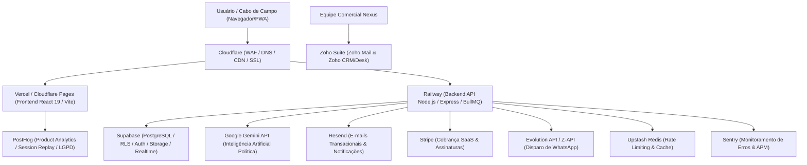
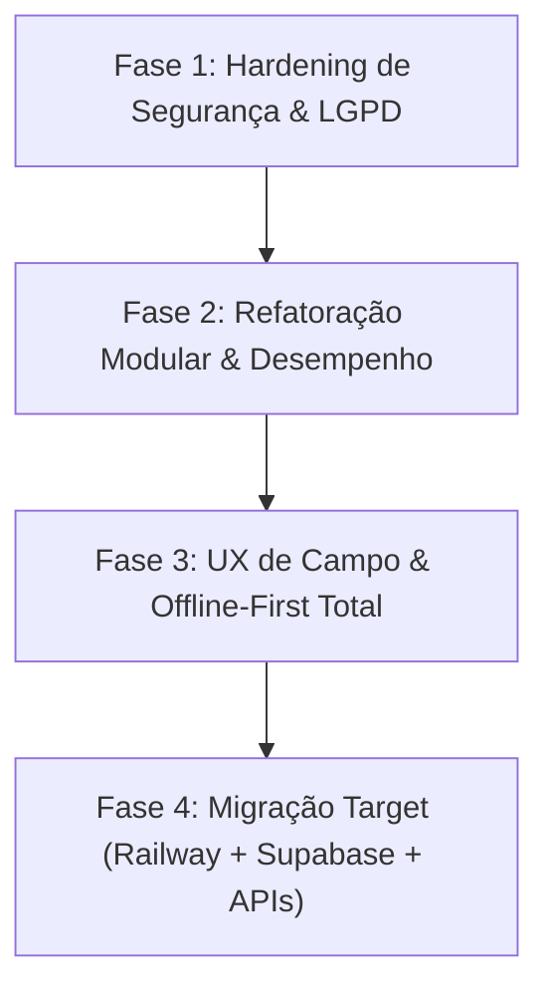

# 🦅 RELATÓRIO ESTRATÉGICO DE AUDITORIA & ARQUITETURA
## NEXUS POLÍTICA / SISTEMA ÁGUIA (2026)
> **Análise Técnica de Segurança, Usabilidade, Tecnologias e Roadmap de Melhorias**  
> **Status:** Análise Concluída | **Modificações em Código Fonte:** Nenhuma (Modo Leitura/Auditoria)  
> **Domínio Analisado:** `https://www.nexuspolitica.com.br/`  
> **Repositório Local:** `d:\FULLSTARK\Sistema-guia`

---

## 📋 SUMÁRIO EXECUTIVO

O **Nexus Política / Sistema Águia** é uma solução web de alta relevância estratégica voltada à coordenação eleitoral, inteligência territorial, controle financeiro de campanha e gestão de lideranças de campo (cabos eleitorais). 

Após uma varredura completa no site em produção (`https://www.nexuspolitica.com.br/`) e no código-fonte local (`Sistema-guia`), identificamos um ecossistema com **excelente proposta de valor funcional e riqueza de recursos**, porém apresentando **vulnerabilidades críticas de segurança no banco de dados**, **gargalos de manutenibilidade por arquivos monolíticos** e **oportunidades decisivas de otimização para usabilidade mobile em zonas de sombra de sinal**.

Este documento apresenta o diagnóstico detalhado divididos em eixos estratégicos, seguidos por uma **Proposta de Naming & Posicionamento de Marca**, **Plano Estratégico de Implementação em 4 Fases** e a **Especificação de Arquitetura Target Enterprise**.

---

## 🏛️ 1. RECOMENDAÇÃO DE NOMING & POSICIONAMENTO ESTRATÉGICO DE MARCA

Para elevar a percepção de valor do software junto a grandes campanhas (Majoritárias, Governo, Senado, Prefeituras de Capitais e Deputados), apresentamos 5 opções estratégicas de nome e posicionamento para substituir ou evoluir as marcas "Nexus Política" / "Sistema Águia":

| # | Nome Sugerido | Posicionamento & Conceito | Slogan Estratégico | Perfil de Campanha Alvo |
| :--- | :--- | :--- | :--- | :--- |
| **1** | **VANGUARDA POLÍTICA** *(Vanguard Political)* | Transmite liderança, estar à frente das pesquisas, visão de futuro e comando soberano da eleição. | *"A tecnologia que lidera a vitória."* | Majoritárias (Governo, Senado, Prefeituras de Grandes Capitais) |
| **2** | **ÁGORA INTELLIGENCE** *(ou Ágora Político)* | Inspirado na Ágora da Grécia Antiga (o centro de decisões e debate cívico). Combina tradição política e dados. | *"Decisão, inteligência e mobilização no centro do comando."* | Campanhas de Alta Performance e Consultorias Políticas |
| **3** | **STRATOS ELEITORAL** *(Stratos Gov)* | Remete à visão de cima ("Visão do General"), inteligência territorial geoespacial e altitude tática. | *"Visão estratégica total: do terreno à decisão."* | Coordenações Regionais e Articulação Política de Campo |
| **4** | **PULSO POLÍTICO** | Foco na capacidade de ouvir a rua em tempo real, captar o sentimento do eleitorado e agir rápido em crises. | *"Sinta o pulso da rua. Decida com precisão."* | Campanhas de Rua, Ouvidoria Ativa e Mobilização de Base |
| **5** | **VETOR POLÍTICA** *(Vector Political)* | Foco na aceleração de votos, direcionamento de forças e precisão matemática de conversão de apoio. | *"A direção exata para a vitória eleitoral."* | Campanhas focadas em Metas de Conversão e CRM Eleitoral |

### 💡 Recomendação de Evolução da Marca Atual:
If o objetivo for manter a força e o domínio atual (`nexuspolitica.com.br`):
*   **NEXUS VANGUARDA:** Evolui a marca Nexus associando-a à vanguarda tecnológica.
*   **ÁGUIA STRATEGIC (ou Águia Intelligence):** Transforma o codinome de projeto "Sistema Águia" em uma marca comercial robusta com forte apelo visual de visão de raio-x e autoridade.

---

## 🛡️ 2. VARREDURA DE SEGURANÇA & CONFORMIDADE LGPD

### 🚨 Vulnerabilidades Críticas Encontradas

#### 2.1 Brecha Grave de Leitura Pública no Firestore (`firestore.rules`)
*   **Diagnóstico:** As regras de segurança atuais no arquivo `firestore.rules` concedem acesso de leitura irrestrito a qualquer visitante anônimo para dados confidenciais:
    ```json
    match /users/{userId} { allow read: if true; }
    match /settings/{settingId} { allow read: if true; }
    match /teams/{teamId} { allow read: if true; }
    match /voters/{voterId} { allow read: if true; allow create: if true; }
    ```
*   **Risco Real:** Qualquer pessoa na internet que inspecione a chave pública do Firebase no bundle JS da `nexuspolitica.com.br` pode realizar consultas REST ou SDK e **extrair toda a base de eleitores, telefones, endereços, redes de influência e dados de lideranças**, configurando vazamento massivo de PII.
*   **Risco de Injeção de Dados:** A regra `allow create: if true;` em `/voters/{voterId}` permite que atacantes injetem milhares de registros falsos (Resource Poisoning) sem qualquer autenticação.

#### 2.2 Ausência de Controle de Acesso Baseado em Funções (RBAC) no Banco
*   **Diagnóstico:** Para as coleções protegidas, a regra utilizada é genérica:
    ```json
    match /transactions/{id} { allow read, write: if isSignedIn(); }
    match /urgencies/{id} { allow read, write: if isSignedIn(); }
    ```
*   **Risco Real:** O controle de permissões (Diferença entre **Administrador**, **Coordenador** e **Líder de Equipe/Cabo**) é feito **apenas na interface React (Client-Side)**. Qualquer usuário autenticado (como um Cabo de Eleitor com conta no sistema) pode disparar requisições diretas para alterar transações financeiras, aprovar seus próprios pedidos de combustível, alterar dados da campanha ou deletar notas estratégicas.

#### 2.3 Riscos de Conformidade com a LGPD (Lei Geral de Proteção de Dados)
*   **Ausência de Criptografia de Campo / Mascaramento:** Dados sensíveis de eleitores (Título de Eleitor, Seção, Zona, foto, geolocalização e sentimento político) são armazenados em texto plano sem mascaramento ou logs de auditoria de consulta.
*   **Falta de Consentimento e Governança de Exclusão:** O cadastro público de eleitor (`PublicVoterRegister.tsx`) não exibe termos explícitos de aceite da LGPD nem política de privacidade configurável.

#### 2.4 Segurança do Servidor Node/Express (`server.ts`)
*   **Falta de Headers de Segurança HTTP:** O servidor não implementa cabeçalhos defensivos como `Content-Security-Policy` (CSP), `X-Frame-Options` (proteção contra Clickjacking), `X-Content-Type-Options` e `Strict-Transport-Security` (HSTS).
*   **Downloads sem Validação Estrita de Caminho:** A rota `/download/arquitetura-doc` utiliza concatenação de caminhos que deve ser rigidamente tratada contra *Path Traversal*.

---

## 🎨 3. VARREDURA DE USABILIDADE & EXPERIÊNCIA DO USUÁRIO (UX/UI)

### 📊 Diagnóstico de Usabilidade

| Elemento | Status Atual | Diagnóstico & Impacto no Usuário |
| :--- | :--- | :--- |
| **Responsividade Mobile** | ⚠️ Parcial | O painel do Cabo (`CaboDashboard.tsx`) possui boa intenção mobile, mas tabelas financeiras e gráficos complexos de D3/Recharts causam rolagem horizontal e overflow em telas de smartphones de 5.5". |
| **Experiência Offline (Campo)** | 🟡 Intermediário | O Firestore IndexedDB está habilitado em `firebase.ts`, mas a interface **não exibe feedback visual claro** quando o cabo entra em zona sem sinal (ex: "Você está offline - 4 cadastros salvos localmente"). |
| **Arquivos Monolíticos (Lag de UI)** | 🚨 Crítico | O `CoordinatorDashboard.tsx` possui **396 KB (~8.000 linhas)** e o `CaboDashboard.tsx` possui **191 KB**. Alterar qualquer estado recalcula a árvore de renderização inteira, causando lentidão no toque mobile. |
| **Acessibilidade (a11y)** | ⚠️ Deficiente | Modais (`DocDownloadModal`, `WhatsAppDispatchModal`, `SupabaseConfigModal`) carecem de atributos `aria-dialog`, foco preso (focus trap) e fechamento universal via tecla `ESC`. |
| **Formulários e Feedback Visual** | 🟢 Bom | Boas animações com `motion` e componentes visualmente atraentes, mas faltam estados de carregamento tipo *Skeleton Screens* durante chamadas assíncronas ao banco. |

---

## ⚡ 4. VARREDURA DE TECNOLOGIAS & ARQUITETURA DE CÓDIGO

### 🛠️ Stack Tecnológico Atual
*   **Frontend Core:** React 19 + Vite 6 + TypeScript 5.8.
*   **Estilização:** Tailwind CSS v4 + Motion (Framer Motion v12) + Lucide React icons.
*   **Banco de Dados & Auth:** Firebase Firestore v12 (Cliente) + Supabase JS v2 (Integração Híbrida).
*   **Servidor Backend:** Node.js + Express 4 + tsx (Atuando como servidor de desenvolvimento, proxy de Open Graph e entrega de arquivos).
*   **Visualização & Documentos:** D3.js + Recharts + XLSX (SheetJS) + jsPDF + docx.
*   **Módulo de Inteligência:** `geminiService.ts` convertido em motor determinístico local por palavras-chave (otimização de custo/sem dependência de API paga).

### 🔍 Oportunidades de Arquitetura Técnica

1. **Ausência de Gerenciador de Estado Global Estruturado:**
   * O sistema utiliza múltiplos estados locais `useState` elevados a níveis superiores com prop-drilling intenso, somados a chamadas diretas de `onSnapshot` espalhadas nos componentes de visualização.
   * **Recomendação:** Adotar **Zustand** para centralizar a store da campanha, autenticação e estados offline.

2. **Bundle Size & Carregamento Inicial:**
   * Bibliotecas pesadas como `jspdf`, `xlsx`, `d3`, e `docx` estão sendo importadas de forma síncrona no topo dos arquivos principais. Isso infla o tamanho do bundle inicial distribuído ao navegador.
   * **Recomendação:** Aplicar *Dynamic Imports* (`import()`) sob demanda apenas quando o usuário clicar em "Exportar PDF" ou "Gerar Excel".

3. **Arquitetura de Integração Híbrida (Firebase + Supabase + Asaas):**
   * O projeto possui conectores para Firebase e Supabase convivendo paralelamente (`firebase.ts`, `supabase.ts`, `asaasConfig.ts`). Falta definir claramente qual é o banco primário da aplicação (Single Source of Truth) para evitar inconsistência de dados entre cadastros.

---

## 🏛️ 5. ARQUITETURA TARGET RECOMENDADA (ENTERPRISE ECOSYSTEM)

Para garantir **escalabilidade comercial como SaaS**, **segurança absoluta LGPD**, **alta disponibilidade** e **inteligência artificial avançada**, especificamos detalhadamente a stack recomendada para a plataforma:



---

### 🔬 Detalhamento dos Componentes da Arquitetura Recomendada

#### 1. 🚂 Railway (Hospedagem de Backend & Microsserviços)
*   **Função:** Plataforma Cloud PaaS moderna para hospedar o servidor backend Node.js/Express, tarefas agendadas (Cron Jobs) e filas de processamento em segundo plano (BullMQ).
*   **Por que utilizar:** Deploy automático via Git (CI/CD), variáveis criptografadas, zero-downtime deployments e ambiente seguro para execução de chaves privadas.

#### 2. ⚡ Supabase (Banco de Dados Principal, Auth, RLS & Storage)
*   **Função:** Atuar como o **Single Source of Truth** (PostgreSQL Relacional).
*   **Por que utilizar:** Row Level Security (RLS) nativo garantindo isolamento total por campanha e usuário, Supabase Auth com JWT/2FA, Supabase Storage para anexos e Realtime Subscriptions via WebSockets.

#### 3. 📧 Resend (Email Transacional & Notificações)
*   **Função:** Envio de e-mails transacionais de alta entregabilidade (convites, relatórios, recibos e recuperação de senha).

#### 4. 🦔 PostHog (Product Analytics & Product Intelligence LGPD)
*   **Função:** Telemetria da aplicação, análise de comportamento de usuários, gravação de sessões com mascaramento automático de PII (LGPD) e Feature Flags.

#### 5. 💼 Zoho Suite (Comunicação Corporativa & Gestão de Clientes B2B)
*   **Função:** E-mails corporativos (`@nexuspolitica.com.br`), CRM de vendas e sistema de chamados/suporte técnico para os clientes.

#### 6. 🛡️ Cloudflare (Edge Security, WAF, DNS & CDN)
*   **Função:** Primeira camada de defesa contra DDoS/SQLi, DNS de baixíssima latência e cache na borda para velocidade instantânea.

#### 7. 💳 Stripe (Gestão de Assinaturas & Cobrança SaaS)
*   **Função:** Processamento de pagamentos recorrentes e checkout transparente para contratação de planos por candidatos e partidos.

#### 8. 🧠 Google Gemini API (Inteligência Artificial Política no Backend)
*   **Função:** Transcrição de áudios de campo, geração de briefings de palanque e análise preditiva de sentimento/crises via chamadas Server-Side seguras.

#### 9. 🛠️ Serviços Adicionais Recomendados:
*   **Evolution API / Z-API:** Gateway de WhatsApp para disparos e alertas automatizados.
*   **Upstash Redis:** Rate-limiting no cadastro público e controle de filas.
*   **Sentry:** Monitoramento de erros e exceções em tempo real.

---

## 🎯 6. PLANO ESTRATÉGICO DE IMPLEMENTAÇÃO (ROADMAP BEST-PRACTICES)



---

### 🛡️ FASE 1: HARDENING DE SEGURANÇA E CONFORMIDADE LGPD (Prioridade Máxima)
1. Reescrita completa do `firestore.rules` (RBAC por Função e Campanha).
2. Sanitização do formulário público com reCAPTCHA v3 e Rate Limiting.
3. Adição de middleware `helmet` e restrição de CORS em `server.ts`.

### ⚡ FASE 2: REFATORAÇÃO DE ARQUITETURA & DESEMPENHO
1. Decomposição dos arquivos monolíticos (`CoordinatorDashboard` e `CaboDashboard`).
2. Implementação de *Code Splitting* (`React.lazy` + `Suspense`).
3. Adição de gerenciamento de estado global com **Zustand**.

### 📱 FASE 3: EXCELÊNCIA EM USABILIDADE (UX) & OPERAÇÃO OFFLINE
1. Barra de status de conectividade em tempo real para os cabos de campo (*Offline Sync Manager*).
2. UI mobile otimizada para toque (botões de 48px e Cards retráteis).

### 🚀 FASE 4: MIGRAÇÃO TARGET (RAILWAY + SUPABASE + ECOSSISTEMA APIS)
1. Migração de dados do Firestore para PostgreSQL no Supabase com RLS.
2. Deploy da API Node.js no Railway com WAF Cloudflare.
3. Conexão das APIs de suporte (Stripe, Resend, Gemini, Evolution, PostHog, Sentry).

---

## 📌 CONCLUSÃO & PRÓXIMOS PASSOS

O software possui um diferencial estratégico massivo. Com a definição de uma **nomenclatura de alto nível**, **hardening imediato no banco** e migração para a **Stack Enterprise recomendada**, a plataforma se tornará um produto dominante no mercado de inteligência política.

---
*Relatório gerado automaticamente para a liderança estratégica.*
