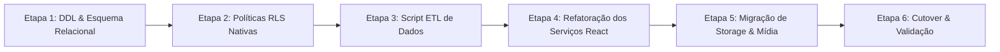
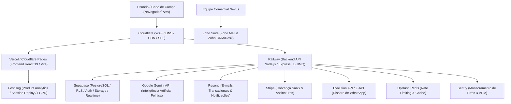
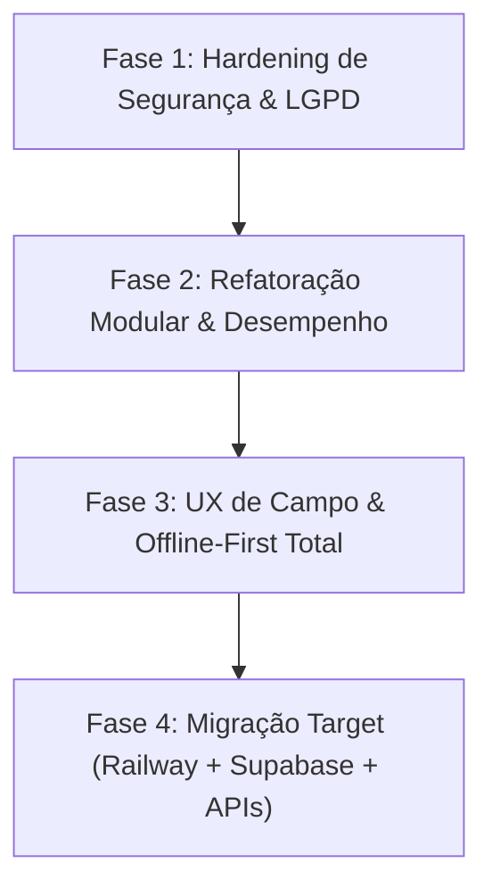

# 🦅 RELATÓRIO ESTRATÉGICO DE AUDITORIA & ARQUITETURA
## NEXUS POLÍTICA / SISTEMA ÁGUIA (2026)
> **Análise Técnica de Segurança, Usabilidade, Tecnologias, Melhorias e Proposta Comercial**  
> **Status:** Análise Concluída | **Modificações em Código Fonte:** Nenhuma (Modo Leitura/Auditoria)  
> **Domínio Analisado:** `https://www.nexuspolitica.com.br/`  
> **Repositório Local:** `d:\FULLSTARK\Sistema-guia`

---

## 📋 SUMÁRIO EXECUTIVO

O **Nexus Política / Sistema Águia** é uma solução web de alta relevância estratégica voltada à coordenação eleitoral, inteligência territorial, controle financeiro de campanha e gestão de lideranças de campo (cabos eleitorais). 

Após uma varredura completa no site em produção (`https://www.nexuspolitica.com.br/`) e no código-fonte local (`Sistema-guia`), identificamos um ecossistema com **excelente proposta de valor funcional e riqueza de recursos**, porém apresentando **vulnerabilidades críticas de segurança no banco de dados**, **gargalos de manutenibilidade por arquivos monolíticos** e **oportunidades decisivas de otimização para usabilidade mobile em zonas de sombra de sinal**.

Este documento apresenta o diagnóstico detalhado divididos em eixos estratégicos, seguidos por uma **Proposta de Naming com Foco Político Puro**, **Detalhamento de Melhorias do Sistema & Plano de Migração Supabase**, **Plano Estratégico de Implementação em 4 Fases**, **Especificação de Arquitetura Target Enterprise**, **Proposta Comercial de Execução** e um **Plano Completo de Precificação & Modelo de Receita**.

---

## 🏛️ 1. RECOMENDAÇÃO DE NAMING COM FOCO POLÍTICO PURO & URNA

Para campanhas eleitorais, partidos e consultores políticos no Brasil, a marca precisa comunicar **imediatamente** poder eleitoral, conquista de votos, organização de base e vitória nas urnas. Apresentamos 8 nomes com foco político direto:

| # | Nome Sugerido | Conceito & Apelo Político | Slogan Estratégico | Perfil de Aplicação |
| :--- | :--- | :--- | :--- | :--- |
| **1** | **GABINETE DE GUERRA** *(War Room)* | Conceito consagrado no marketing político para o centro de comando de campanha que reage em tempo real. | *"O centro de comando da sua vitória."* | Campanhas de Alto Impacto (Governo, Prefeitura, Senado) |
| **2** | **COMANDO ELEITORAL** | Transmite hierarquia tática, controle absoluto das lideranças de campo e ordem de mobilização. | *"Inteligência de campo e controle total da eleição."* | Coordenação Geral de Campanha e Grandes Coligações |
| **3** | **PLEITO INTELLIGENCE** | *"Pleito"* é o termo jurídico-político oficial para a eleição nas urnas. Passa sofisticação e autoridade. | *"Dados e estratégia para dominar o pleito."* | Consultorias Políticas, Marqueteiros e Analistas |
| **4** | **MANDATO 360** | Conecta diretamente a campanha ao objetivo final: a conquista e a gestão do Mandato Político. | *"Da campanha à gestão do mandato."* | Deputados, Prefeitos e Vereadores (Campanha + Mandato) |
| **5** | **VOTO & BASE** | Termo direto e focado no core da política de rua: cadastrar a base e converter em votos no Dia D. | *"Organize sua base. Garanta cada voto."* | Operações de Campo, Cabos Eleitorais e Mobilização |
| **6** | **PALANQUE DIGITAL** | Remete ao principal símbolo da política brasileira (o palanque), modernizado com tecnologia de ponta. | *"A força da sua militância no ambiente digital."* | Comunicação de Campanha, Redes e Disparo de Lideranças |
| **7** | **URNA CERTA** | Comunica precisão matemática no resultado final. Focado em auditoria de votos e metas por seção. | *"A precisão dos números rumo às urnas."* | Inteligência Geoeleitoral e Fiscalização de Dia D |
| **8** | **SOBERANA POLÍTICA** | Transmite imponência, força política incontestável e domínio territorial completo da base. | *"A plataforma soberana para grandes campanhas."* | Grandes Partidos, Coligações Majoritárias e Governo |

---

## 🛡️ 2. VARREDURA DE SEGURANÇA & CONFORMIDADE LGPD

### 🚨 Vulnerabilidades Críticas Encontradas

#### 2.1 Brecha Grave de Leitura Pública no Firestore (`firestore.rules`)
*   **Diagnóstico:** As regras de segurança atuais no arquivo `firestore.rules` concedem acesso de leitura irrestrito a qualquer visitante anônimo para dados confidenciais:
    ```json
    match /users/{userId} { allow read: if true; }
    match /settings/{settingId} { allow read: if true; }
    match /teams/{teamId} { allow read: if true; }
    match /voters/{voterId} { allow read: if true; allow create: if true; }
    ```
*   **Risco Real:** Qualquer pessoa na internet que inspecione a chave pública do Firebase no bundle JS da `nexuspolitica.com.br` pode realizar consultas REST ou SDK e **extrair toda a base de eleitores, telefones, endereços, redes de influência e dados de lideranças**, configurando vazamento massivo de PII.
*   **Risco de Injeção de Dados:** A regra `allow create: if true;` em `/voters/{voterId}` permite que atacantes injetem milhares de registros falsos (Resource Poisoning) sem qualquer autenticação.

#### 2.2 Ausência de Controle de Acesso Baseado em Funções (RBAC) no Banco
*   **Diagnóstico:** Para as coleções protegidas, a regra utilizada é genérica:
    ```json
    match /transactions/{id} { allow read, write: if isSignedIn(); }
    match /urgencies/{id} { allow read, write: if isSignedIn(); }
    ```
*   **Risco Real:** O controle de permissões (Diferença entre **Administrador**, **Coordenador** e **Líder de Equipe/Cabo**) é feito **apenas na interface React (Client-Side)**. Qualquer usuário autenticado (como um Cabo de Eleitor com conta no sistema) pode disparar requisições diretas para alterar transações financeiras, aprovar seus próprios pedidos de combustível, alterar dados da campanha ou deletar notas estratégicas.

#### 2.3 Riscos de Conformidade com a LGPD (Lei Geral de Proteção de Dados)
*   **Ausência de Criptografia de Campo / Mascaramento:** Dados sensíveis de eleitores (Título de Eleitor, Seção, Zona, foto, geolocalização e sentimento político) são armazenados em texto plano sem mascaramento ou logs de auditoria de consulta.
*   **Falta de Consentimento e Governança de Exclusão:** O cadastro público de eleitor (`PublicVoterRegister.tsx`) não exibe termos explícitos de aceite da LGPD nem política de privacidade configurável.

#### 2.4 Segurança do Servidor Node/Express (`server.ts`)
*   **Falta de Headers de Segurança HTTP:** O servidor não implementa cabeçalhos defensivos como `Content-Security-Policy` (CSP), `X-Frame-Options` (proteção contra Clickjacking), `X-Content-Type-Options` e `Strict-Transport-Security` (HSTS).
*   **Downloads sem Validação Estrita de Caminho:** A rota `/download/arquitetura-doc` utiliza concatenação de caminhos que deve ser rigidamente tratada contra *Path Traversal*.

---

## 🎨 3. VARREDURA DE USABILIDADE & EXPERIÊNCIA DO USUÁRIO (UX/UI)

### 📊 Diagnóstico de Usabilidade

| Elemento | Status Atual | Diagnóstico & Impacto no Usuário |
| :--- | :--- | :--- |
| **Responsividade Mobile** | ⚠️ Parcial | O painel do Cabo (`CaboDashboard.tsx`) possui boa intenção mobile, mas tabelas financeiras e gráficos complexos de D3/Recharts causam rolagem horizontal e overflow em telas de smartphones de 5.5". |
| **Experiência Offline (Campo)** | 🟡 Intermediário | O Firestore IndexedDB está habilitado em `firebase.ts`, mas a interface **não exibe feedback visual claro** quando o cabo entra em zona sem sinal (ex: "Você está offline - 4 cadastros salvos localmente"). |
| **Arquivos Monolíticos (Lag de UI)** | 🚨 Crítico | O `CoordinatorDashboard.tsx` possui **396 KB (~8.000 linhas)** e o `CaboDashboard.tsx` possui **191 KB**. Alterar qualquer estado recalcula a árvore de renderização inteira, causando lentidão no toque mobile. |
| **Acessibilidade (a11y)** | ⚠️ Deficiente | Modais (`DocDownloadModal`, `WhatsAppDispatchModal`, `SupabaseConfigModal`) carecem de atributos `aria-dialog`, foco preso (focus trap) e fechamento universal via tecla `ESC`. |
| **Formulários e Feedback Visual** | 🟢 Bom | Boas animações com `motion` e componentes visualmente atraentes, mas faltam estados de carregamento tipo *Skeleton Screens* durante chamadas assíncronas ao banco. |

---

## ⚡ 4. VARREDURA DE TECNOLOGIAS & ARQUITETURA DE CÓDIGO

### 🛠️ Stack Tecnológico Atual
*   **Frontend Core:** React 19 + Vite 6 + TypeScript 5.8.
*   **Estilização:** Tailwind CSS v4 + Motion (Framer Motion v12) + Lucide React icons.
*   **Banco de Dados & Auth:** Firebase Firestore v12 (Cliente) + Supabase JS v2 (Integração Híbrida).
*   **Servidor Backend:** Node.js + Express 4 + tsx (Atuando como servidor de desenvolvimento, proxy de Open Graph e entrega de arquivos).
*   **Visualização & Documentos:** D3.js + Recharts + XLSX (SheetJS) + jsPDF + docx.
*   **Módulo de Inteligência:** `geminiService.ts` convertido em motor determinístico local por palavras-chave (otimização de custo/sem dependência de API paga).

---

## 🚀 5. DETALHAMENTO DE MELHORIAS DO SISTEMA & PLANO DE MIGRAÇÃO SUPABASE

### 5.1 Módulo de Campo & PWA (Operação dos Cabos Eleitorais)
*   **Sincronização Offline Inteligente (IndexedDB + PWA Workbox):** Criar um indicador no rodapé do app que contabiliza os cadastros locais sem sinal e realiza a sincronização em lote (batch background sync) assim que o celular reconectar.
*   **Validação Antifraude de Ponto (GPS Spoofing Shield):** Validação no backend de Mock Location para impedir que líderes falsifiquem o check-in de ponto simulando localização GPS via aplicativos de terceiros.
*   **Leitor de Título de Eleitor via Câmera (OCR/QR Code):** Leitura instantânea do QR Code do e-Título ou OCR da foto da identidade para preenchimento automático do nome, zona, seção e município.

### 5.2 Módulo de CRM Eleitoral & Árvore de Influência
*   **Visualizador Gráfico da Rede de Padrinhos Políticos:** Interface interativa (estilo grafo D3/Canvas) mostrando quem indicou quem na campanha, destacando graficamente as maiores lideranças "puxadoras de voto".
*   **Deduplicação de Eleitores por CPF/Título:** Algoritmo automático de merge para impedir que duas equipes cadastrem o mesmo eleitor no sistema.

### 5.3 Módulo de Inteligência Artificial & Voz (Gemini 1.5 + Whisper)
*   **Transcrição de Áudios de WhatsApp e Campo:** Transcrição e criação automática de alertas de crise e tarefas de logística.
*   **Gerador de Discurso de Palanque (Briefing do Candidato):** Geração automática de resumo tático por município/bairro em 5 segundos.

---

### 🔄 5.5 PLANO DETALHADO DE MIGRAÇÃO FIREBASE -> SUPABASE (POSTGRESQL + RLS)

Para eliminar definitivamente as brechas de segurança do Firestore e adotar um banco relacional robusto com **Row Level Security (RLS)** nativo, definimos o plano de migração estruturado em 6 etapas:



#### 📌 Etapa 1: Modelagem do Esquema Relacional no PostgreSQL (Supabase DDL)
Transformação das coleções NoSQL desacopladas em tabelas relacionais com PKs (UUID), FKs e Índices de alta performance:

```sql
-- 1. Perfil dos Usuários e Roles (Vinculado a auth.users)
CREATE TABLE public.profiles (
  id UUID PRIMARY KEY REFERENCES auth.users(id) ON DELETE CASCADE,
  email TEXT NOT NULL,
  full_name TEXT NOT NULL,
  role TEXT CHECK (role IN ('admin', 'coordenador', 'cabo')) NOT NULL DEFAULT 'cabo',
  campaign_id UUID,
  created_at TIMESTAMPTZ DEFAULT NOW()
);

-- 2. Tabela de Equipes e Cotas
CREATE TABLE public.teams (
  id UUID PRIMARY KEY DEFAULT gen_random_uuid(),
  campaign_id UUID NOT NULL,
  name TEXT NOT NULL,
  leader_id UUID REFERENCES public.profiles(id),
  allocated_budget NUMERIC(12,2) DEFAULT 0.00,
  spent_budget NUMERIC(12,2) DEFAULT 0.00,
  created_at TIMESTAMPTZ DEFAULT NOW()
);

-- 3. Base de Eleitores (Com Geolocalização e Indicador)
CREATE TABLE public.voters (
  id UUID PRIMARY KEY DEFAULT gen_random_uuid(),
  campaign_id UUID NOT NULL,
  name TEXT NOT NULL,
  phone TEXT,
  address TEXT,
  zone TEXT,
  section TEXT,
  sentiment TEXT CHECK (sentiment IN ('Apoiador', 'Neutro', 'Oposição')),
  leader_id UUID REFERENCES public.profiles(id) NOT NULL,
  indicated_by UUID REFERENCES public.voters(id),
  geo_lat DOUBLE PRECISION,
  geo_lng DOUBLE PRECISION,
  created_at TIMESTAMPTZ DEFAULT NOW()
);

-- 4. Transações Financeiras e Recibos
CREATE TABLE public.transactions (
  id UUID PRIMARY KEY DEFAULT gen_random_uuid(),
  campaign_id UUID NOT NULL,
  team_id UUID REFERENCES public.teams(id),
  type TEXT CHECK (type IN ('RECEITA', 'DESPESA', 'COTA')),
  amount NUMERIC(12,2) NOT NULL,
  category TEXT NOT NULL,
  receipt_url TEXT,
  signed_by UUID REFERENCES public.profiles(id),
  created_at TIMESTAMPTZ DEFAULT NOW()
);
```

#### 🛡️ Etapa 2: Implementação de Políticas RLS (Row Level Security)
Segurança garantida no motor do banco PostgreSQL:

```sql
-- Habilitar RLS em todas as tabelas
ALTER TABLE public.voters ENABLE ROW LEVEL SECURITY;
ALTER TABLE public.transactions ENABLE ROW LEVEL SECURITY;

-- Política RLS para Eleitores:
-- Cabos só lêem/criam eleitores de sua autoria; Coordenadores lêem todos da campanha.
CREATE POLICY "Voters Access Policy" ON public.voters
  FOR ALL USING (
    auth.uid() = leader_id 
    OR EXISTS (
      SELECT 1 FROM public.profiles 
      WHERE profiles.id = auth.uid() AND profiles.role IN ('admin', 'coordenador')
    )
  );
```

#### 📦 Etapa 3: Script de Extração, Transformação e Carga (ETL Node.js)
*   Criar o script `scripts/migrate-firestore-to-supabase.ts` utilizando `firebase-admin` e `@supabase/supabase-js`.
*   Leitura em lote (*batch read*) do Firestore, conversão dos campos de Timestamp para `TIMESTAMPTZ` e inserção relacional no Supabase com validação de integridade referencial.

#### 🔄 Etapa 4: Substituição das Camadas de Serviço do Frontend
*   Substituir `src/lib/firestoreService.ts` por `src/lib/supabaseService.ts`.
*   Migrar listeners do `onSnapshot` para canais de WebSockets nativos do Supabase:
    ```typescript
    const channel = supabase
      .channel('voters-realtime')
      .on('postgres_changes', { event: '*', schema: 'public', table: 'voters' }, (payload) => {
        updateVotersState(payload);
      })
      .subscribe();
    ```

#### 📁 Etapa 5: Migração de Storage (Fotos e Documentos)
*   Transferência dos arquivos do Firebase Storage para Buckets Privados do Supabase Storage (`voter-docs`, `receipts`, `checkins`) acessados estritamente via URLs assinadas temporárias (*Signed URLs*).

#### 🧪 Etapa 6: Validação, Testes de Carga e Virada de Chave (Cutover)
*   Execução de testes de regressão automatizados e chaveamento de ambiente (Cutover) em janela programada de 30 minutos sem perda de dados.

---

## 🏛️ 6. ARQUITETURA TARGET RECOMENDADA (ENTERPRISE ECOSYSTEM)



---

## 🎯 7. PLANO ESTRATÉGICO DE IMPLEMENTAÇÃO (ROADMAP BEST-PRACTICES)



---

## 💼 8. PROPOSTA COMERCIAL & DE EXECUÇÃO DO PROJETO

### 8.1 Escopo dos Serviços Técnicos
1. **Pacote 1: Blindagem de Segurança & Proteção LGPD** (Firestore / Supabase RLS).
2. **Pacote 2: Refatoração de Arquitetura & Otimização Mobile** (Fim dos arquivos monolíticos + Zustand).
3. **Pacote 3: Módulos Avançados de Campo & WhatsApp** (PWA Offline, QR Code e Gateway Z-API/Evolution).
4. **Pacote 4: Migração Completa para Supabase & IA** (Railway + Supabase PostgreSQL + Cloudflare + Gemini 1.5).

---

## 💳 9. PLANO COMPLETO DE PRECIFICAÇÃO & MODELO DE RECEITA (PRICING MATRIX)

### 💵 MODALIDADE A: LICENÇA DE CAMPANHA ELEITORAL (Ciclo Eleitoral)

| Plano | Perfil de Candidato | Limites de Recursos | Preço À Vista | Parcelamento (Cartão/Boleto) |
| :--- | :--- | :--- | :--- | :--- |
| 🥉 **VEREADOR / MUNICIPIO PEQUENO** | Candidatos a Vereador e Prefeituras até 50k hab. | • Até 3.000 Eleitores<br>• Até 10 Líderes de Campo<br>• 1 Coordenador | **R$ 4.900** | 6x de **R$ 900** |
| 🥈 **DEPUTADO ESTADUAL / PREFEITO P** | Prefeituras Médias e Deputados Estaduais | • Até 20.000 Eleitores<br>• Até 50 Líderes de Campo<br>• 3 Coordenadores | **R$ 14.900** | 6x de **R$ 2.750** |
| 🥇 **DEPUTADO FEDERAL / PREFEITO G** | Cidades de Grande Porte e Deputados Federais | • Até 80.000 Eleitores<br>• Até 200 Líderes de Campo<br>• 10 Coordenadores | **R$ 34.900** | 6x de **R$ 6.300** |
| 👑 **MAJORITÁRIO (GOVERNO / SENADO / CAPITAL)** | Campanhas para Governador, Senador e Capitais | • Eleitores Ilimitados<br>• Líderes Ilimitados<br>• Coordenadores Ilimitados | **R$ 89.000 a R$ 250.000** *(Sob Consulta)* | Condições Especiais |

---

### 🔄 MODALIDADE B: GESTÃO DE MANDATO CONTÍNUO (SaaS Mensal)
*   **Mandato Vereador / Líder Local:** **R$ 490 / mês** *(ou R$ 4.900/ano)*
*   **Mandato Deputado Estadual / Prefeito:** **R$ 1.290 / mês** *(ou R$ 12.900/ano)*
*   **Mandato Deputado Federal / Prefeito Capital:** **R$ 2.890 / mês** *(ou R$ 28.900/ano)*
*   **Mandato Senador / Governador:** **R$ 5.900 / mês**

---

### 🏢 MODALIDADE C: WHITE-LABEL PARA AGÊNCIAS & CONSULTORIAS POLÍTICAS
*   **Pacote Agência Partner (Até 15 Campanhas de Vereador + 3 Prefeitos):** **R$ 59.000 / ciclo eleitoral** *(com marca própria e painel master)*.

---

## 📌 CONCLUSÃO & PRÓXIMOS PASSOS

Com o **Plano de Migração Supabase** detalhado, a infraestrutura estará totalmente blindada contra vazamentos e apta a suportar operações massivas de dados com tempo de resposta em milissegundos.

### Recomendação de Execução Imediata:
1. Aprovar o plano de migração Supabase.
2. Criar o projeto no Supabase e executar os scripts DDL (Etapa 1).
3. Iniciar o desenvolvimento do script ETL de migração de dados.

---
*Relatório gerado automaticamente para a liderança estratégica.*
