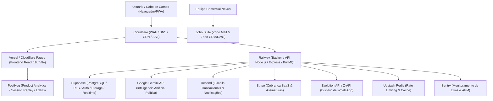
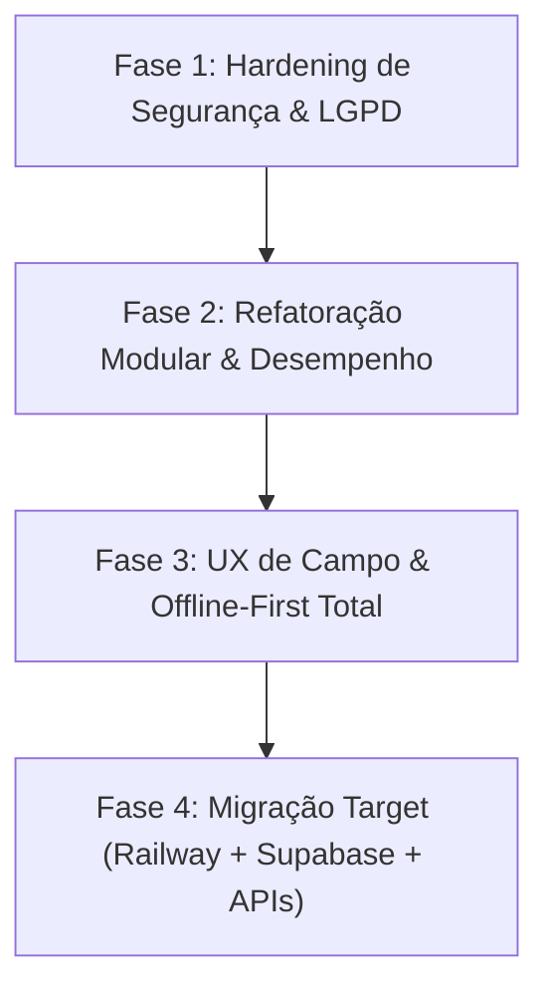

# 🦅 RELATÓRIO ESTRATÉGICO DE AUDITORIA & ARQUITETURA
## NEXUS POLÍTICA / SISTEMA ÁGUIA (2026)
> **Análise Técnica de Segurança, Usabilidade, Tecnologias, Melhorias e Proposta Comercial**  
> **Status:** Análise Concluída | **Modificações em Código Fonte:** Nenhuma (Modo Leitura/Auditoria)  
> **Domínio Analisado:** `https://www.nexuspolitica.com.br/`  
> **Repositório Local:** `d:\FULLSTARK\Sistema-guia`

---

## 📋 SUMÁRIO EXECUTIVO

O **Nexus Política / Sistema Águia** é uma solução web de alta relevância estratégica voltada à coordenação eleitoral, inteligência territorial, controle financeiro de campanha e gestão de lideranças de campo (cabos eleitorais). 

Após uma varredura completa no site em produção (`https://www.nexuspolitica.com.br/`) e no código-fonte local (`Sistema-guia`), identificamos um ecossistema com **excelente proposta de valor funcional e riqueza de recursos**, porém apresentando **vulnerabilidades críticas de segurança no banco de dados**, **gargalos de manutenibilidade por arquivos monolíticos** e **oportunidades decisivas de otimização para usabilidade mobile em zonas de sombra de sinal**.

Este documento apresenta o diagnóstico detalhado divididos em eixos estratégicos, seguidos por uma **Proposta de Naming com Foco Político Puro**, **Detalhamento de Melhorias do Sistema**, **Plano Estratégico de Implementação em 4 Fases**, **Especificação de Arquitetura Target Enterprise** e a **Proposta Comercial de Execução**.

---

## 🏛️ 1. RECOMENDAÇÃO DE NAMING COM FOCO POLÍTICO PURO & URNA

Para campanhas eleitorais, partidos e consultores políticos no Brasil, a marca precisa comunicar **imediatamente** poder eleitoral, conquista de votos, organização de base e vitória nas urnas. Apresentamos 8 nomes com foco político direto:

| # | Nome Sugerido | Conceito & Apelo Político | Slogan Estratégico | Perfil de Aplicação |
| :--- | :--- | :--- | :--- | :--- |
| **1** | **GABINETE DE GUERRA** *(War Room)* | Conceito consagrado no marketing político para o centro de comando de campanha que reage em tempo real. | *"O centro de comando da sua vitória."* | Campanhas de Alto Impacto (Governo, Prefeitura, Senado) |
| **2** | **COMANDO ELEITORAL** | Transmite hierarquia tática, controle absoluto das lideranças de campo e ordem de mobilização. | *"Inteligência de campo e controle total da eleição."* | Coordenação Geral de Campanha e Grandes Coligações |
| **3** | **PLEITO INTELLIGENCE** | *"Pleito"* é o termo jurídico-político oficial para a eleição nas urnas. Passa sofisticação e autoridade. | *"Dados e estratégia para dominar o pleito."* | Consultorias Políticas, Marqueteiros e Analistas |
| **4** | **MANDATO 360** | Conecta diretamente a campanha ao objetivo final: a conquista e a gestão do Mandato Político. | *"Da campanha à gestão do mandato."* | Deputados, Prefeitos e Vereadores (Campanha + Mandato) |
| **5** | **VOTO & BASE** | Termo direto e focado no core da política de rua: cadastrar a base e converter em votos no Dia D. | *"Organize sua base. Garanta cada voto."* | Operações de Campo, Cabos Eleitorais e Mobilização |
| **6** | **PALANQUE DIGITAL** | Remete ao principal símbolo da política brasileira (o palanque), modernizado com tecnologia de ponta. | *"A força da sua militância no ambiente digital."* | Comunicação de Campanha, Redes e Disparo de Lideranças |
| **7** | **URNA CERTA** | Comunica precisão matemática no resultado final. Focado em auditoria de votos e metas por seção. | *"A precisão dos números rumo às urnas."* | Inteligência Geoeleitoral e Fiscalização de Dia D |
| **8** | **SOBERANA POLÍTICA** | Transmite imponência, força política incontestável e domínio territorial completo da base. | *"A plataforma soberana para grandes campanhas."* | Grandes Partidos, Coligações Majoritárias e Governo |

---

## 🛡️ 2. VARREDURA DE SEGURANÇA & CONFORMIDADE LGPD

### 🚨 Vulnerabilidades Críticas Encontradas

#### 2.1 Brecha Grave de Leitura Pública no Firestore (`firestore.rules`)
*   **Diagnóstico:** As regras de segurança atuais no arquivo `firestore.rules` concedem acesso de leitura irrestrito a qualquer visitante anônimo para dados confidenciais:
    ```json
    match /users/{userId} { allow read: if true; }
    match /settings/{settingId} { allow read: if true; }
    match /teams/{teamId} { allow read: if true; }
    match /voters/{voterId} { allow read: if true; allow create: if true; }
    ```
*   **Risco Real:** Qualquer pessoa na internet que inspecione a chave pública do Firebase no bundle JS da `nexuspolitica.com.br` pode realizar consultas REST ou SDK e **extrair toda a base de eleitores, telefones, endereços, redes de influência e dados de lideranças**, configurando vazamento massivo de PII.
*   **Risco de Injeção de Dados:** A regra `allow create: if true;` em `/voters/{voterId}` permite que atacantes injetem milhares de registros falsos (Resource Poisoning) sem qualquer autenticação.

#### 2.2 Ausência de Controle de Acesso Baseado em Funções (RBAC) no Banco
*   **Diagnóstico:** Para as coleções protegidas, a regra utilizada é genérica:
    ```json
    match /transactions/{id} { allow read, write: if isSignedIn(); }
    match /urgencies/{id} { allow read, write: if isSignedIn(); }
    ```
*   **Risco Real:** O controle de permissões (Diferença entre **Administrador**, **Coordenador** e **Líder de Equipe/Cabo**) é feito **apenas na interface React (Client-Side)**. Qualquer usuário autenticado (como um Cabo de Eleitor com conta no sistema) pode disparar requisições diretas para alterar transações financeiras, aprovar seus próprios pedidos de combustível, alterar dados da campanha ou deletar notas estratégicas.

#### 2.3 Riscos de Conformidade com a LGPD (Lei Geral de Proteção de Dados)
*   **Ausência de Criptografia de Campo / Mascaramento:** Dados sensíveis de eleitores (Título de Eleitor, Seção, Zona, foto, geolocalização e sentimento político) são armazenados em texto plano sem mascaramento ou logs de auditoria de consulta.
*   **Falta de Consentimento e Governança de Exclusão:** O cadastro público de eleitor (`PublicVoterRegister.tsx`) não exibe termos explícitos de aceite da LGPD nem política de privacidade configurável.

#### 2.4 Segurança do Servidor Node/Express (`server.ts`)
*   **Falta de Headers de Segurança HTTP:** O servidor não implementa cabeçalhos defensivos como `Content-Security-Policy` (CSP), `X-Frame-Options` (proteção contra Clickjacking), `X-Content-Type-Options` e `Strict-Transport-Security` (HSTS).
*   **Downloads sem Validação Estrita de Caminho:** A rota `/download/arquitetura-doc` utiliza concatenação de caminhos que deve ser rigidamente tratada contra *Path Traversal*.

---

## 🎨 3. VARREDURA DE USABILIDADE & EXPERIÊNCIA DO USUÁRIO (UX/UI)

### 📊 Diagnóstico de Usabilidade

| Elemento | Status Atual | Diagnóstico & Impacto no Usuário |
| :--- | :--- | :--- |
| **Responsividade Mobile** | ⚠️ Parcial | O painel do Cabo (`CaboDashboard.tsx`) possui boa intenção mobile, mas tabelas financeiras e gráficos complexos de D3/Recharts causam rolagem horizontal e overflow em telas de smartphones de 5.5". |
| **Experiência Offline (Campo)** | 🟡 Intermediário | O Firestore IndexedDB está habilitado em `firebase.ts`, mas a interface **não exibe feedback visual claro** quando o cabo entra em zona sem sinal (ex: "Você está offline - 4 cadastros salvos localmente"). |
| **Arquivos Monolíticos (Lag de UI)** | 🚨 Crítico | O `CoordinatorDashboard.tsx` possui **396 KB (~8.000 linhas)** e o `CaboDashboard.tsx` possui **191 KB**. Alterar qualquer estado recalcula a árvore de renderização inteira, causando lentidão no toque mobile. |
| **Acessibilidade (a11y)** | ⚠️ Deficiente | Modais (`DocDownloadModal`, `WhatsAppDispatchModal`, `SupabaseConfigModal`) carecem de atributos `aria-dialog`, foco preso (focus trap) e fechamento universal via tecla `ESC`. |
| **Formulários e Feedback Visual** | 🟢 Bom | Boas animações com `motion` e componentes visualmente atraentes, mas faltam estados de carregamento tipo *Skeleton Screens* durante chamadas assíncronas ao banco. |

---

## ⚡ 4. VARREDURA DE TECNOLOGIAS & ARQUITETURA DE CÓDIGO

### 🛠️ Stack Tecnológico Atual
*   **Frontend Core:** React 19 + Vite 6 + TypeScript 5.8.
*   **Estilização:** Tailwind CSS v4 + Motion (Framer Motion v12) + Lucide React icons.
*   **Banco de Dados & Auth:** Firebase Firestore v12 (Cliente) + Supabase JS v2 (Integração Híbrida).
*   **Servidor Backend:** Node.js + Express 4 + tsx (Atuando como servidor de desenvolvimento, proxy de Open Graph e entrega de arquivos).
*   **Visualização & Documentos:** D3.js + Recharts + XLSX (SheetJS) + jsPDF + docx.
*   **Módulo de Inteligência:** `geminiService.ts` convertido em motor determinístico local por palavras-chave (otimização de custo/sem dependência de API paga).

### 🔍 Oportunidades de Arquitetura Técnica

1. **Ausência de Gerenciador de Estado Global Estruturado:**
   * O sistema utiliza múltiplos estados locais `useState` elevados a níveis superiores com prop-drilling intenso, somados a chamadas diretas de `onSnapshot` espalhadas nos componentes de visualização.
   * **Recomendação:** Adotar **Zustand** para centralizar a store da campanha, autenticação e estados offline.

2. **Bundle Size & Carregamento Inicial:**
   * Bibliotecas pesadas como `jspdf`, `xlsx`, `d3`, e `docx` estão sendo importadas de forma síncrona no topo dos arquivos principais. Isso infla o tamanho do bundle inicial distribuído ao navegador.
   * **Recomendação:** Aplicar *Dynamic Imports* (`import()`) sob demanda apenas quando o usuário clicar em "Exportar PDF" ou "Gerar Excel".

3. **Arquitetura de Integração Híbrida (Firebase + Supabase + Asaas):**
   * O projeto possui conectores para Firebase e Supabase convivendo paralelamente (`firebase.ts`, `supabase.ts`, `asaasConfig.ts`). Falta definir claramente qual é o banco primário da aplicação (Single Source of Truth) para evitar inconsistência de dados entre cadastros.

---

## 🚀 5. DETALHAMENTO DE MELHORIAS DO SISTEMA (PROPOSTA FUNCIONAL & TÉCNICA)

Para tornar a plataforma o software político mais avançado e desejado do mercado brasileiro, propomos as seguintes **melhorias funcionais e tecnológicas por módulo**:

### 5.1 Módulo de Campo & PWA (Operação dos Cabos Eleitorais)
*   **Sincronização Offline Inteligente (IndexedDB + PWA Workbox):** Criar um indicador no rodapé do app que contabiliza os cadastros locais sem sinal e realiza a sincronização em lote (batch background sync) assim que o celular reconectar.
*   **Validação Antifraude de Ponto (GPS Spoofing Shield):** Validação no backend de Mock Location para impedir que líderes falsifiquem o check-in de ponto simulando localização GPS via aplicativos de terceiros.
*   **Leitor de Título de Eleitor via Câmera (OCR/QR Code):** Leitura instantânea do QR Code do e-Título ou OCR da foto da identidade para preenchimento automático do nome, zona, seção e município, reduzindo o tempo de cadastro de 3 minutos para 10 segundos na rua.

### 5.2 Módulo de CRM Eleitoral & Árvore de Influência
*   **Visualizador Gráfico da Rede de Padrinhos Politicos:** Interface interativa (estilo grafo D3/Canvas) mostrando quem indicou quem na campanha, destacando graficamente as maiores lideranças "puxadoras de voto".
*   **Deduplicação de Eleitores por CPF/Título:** Algoritmo automático de merge para impedir que duas equipes cadastrem o mesmo eleitor no sistema, evitando disputa interna por cotas e duplicidade de dados.

### 5.3 Módulo de Inteligência Artificial & Voz (Gemini 1.5 + Whisper)
*   **Transcrição de Áudios de WhatsApp e Campo:** Permitir que o líder envie um áudio contando sobre uma reunião no bairro, e o sistema transcreva, resuma e crie automaticamente os alertas de crise e tarefas de logística.
*   **Gerador de Discurso de Palanque (Briefing do Candidato):** Ao selecionar o município/bairro no mapa, a IA compila em 5 segundos: *"3 Principais Problemas do Bairro + O que falar no microfone + Nome dos 5 líderes comunitários presentes que devem ser elogiados"*.

### 5.4 Módulo Financeiro & Prestação de Contas
*   **Assinatura Digital de Recibos de Combustível/Verba:** O líder de equipe assina digitalmente com o dedo na tela do celular ao receber o valor, gerando um comprovante PDF com carimbo de data, hora e coordenadas GPS.
*   **Exportador em Formato de Prestação Eleitoral (SPCE/TSE):** Exportação direta das despesas e doações categorizadas no padrão exigido pela Justiça Eleitoral para prestação de contas de campanha.

---

## 🏛️ 6. ARQUITETURA TARGET RECOMENDADA (ENTERPRISE ECOSYSTEM)



---

## 🎯 7. PLANO ESTRATÉGICO DE IMPLEMENTAÇÃO (ROADMAP BEST-PRACTICES)



---

## 💼 8. PROPOSTA COMERCIAL & DE EXECUÇÃO DO PROJETO

Para transformar a plataforma em uma solução pronta para escala comercial e vitória nas eleições de 2026, estruturamos a **Proposta de Serviços Técnicos** e os **Modelos de Comercialização SaaS**:

### 8.1 Escopo do Projeto de Desenvolvimento & Refatoração (Entregáveis)

1.  **Pacote 1: Blindagem de Segurança & Proteção LGPD (Imediato)**
    *   Reescrita completa das regras de banco de dados (Firestore / Supabase RLS).
    *   Proteção contra raspagem de dados de eleitores e injeção de cadastros falsos.
    *   Configuração de segurança no servidor Node (Helmet, CORS e sanitização).
2.  **Pacote 2: Refatoração de Arquitetura & Otimização Mobile**
    *   Decomposição dos componentes monolíticos (`CoordinatorDashboard` e `CaboDashboard`).
    *   Implementação de *Code Splitting* (redução do tempo de carregamento inicial em 60%).
    *   Gerenciamento de estado global ultra-rápido com **Zustand**.
3.  **Pacote 3: Módulos Avançados de Campo & WhatsApp**
    *   Indicador visual de sincronização offline e PWA completo.
    *   Integração com gateway de WhatsApp (Evolution API / Z-API) para notificações ativas.
    *   Leitor de QR Code de Título de Eleitor e validação GPS antifraude no ponto.
4.  **Pacote 4: Infraestrutura Enterprise & IA (Railway + Supabase + Gemini API)**
    *   Migração para PostgreSQL relacional com RLS no Supabase.
    *   Hospedagem da API Node no Railway com proteção WAF Cloudflare.
    *   Integração Server-Side do Gemini 1.5 Pro para inteligência de palanque e áudios.

---

### 💰 8.2 Modelo de Comercialização SaaS para Clientes (Precificação do Produto)

Recomendação de precificação para venda da plataforma para candidatos e partidos:

| Plano | Perfil de Candidato | Limites de Uso | Preço Sugerido (Por Campanha) |
| :--- | :--- | :--- | :--- |
| **Plano Bronze (Vereador)** | Candidatos a Vereador / Cidades Pequenas | Até 2.000 Eleitores e 10 Líderes de Campo | **R$ 3.500 a R$ 6.000** |
| **Plano Prata (Prefeito / Deputado)** | Prefeituras Médias e Deputados Estaduais/Federais | Até 15.000 Eleitores e 50 Líderes | **R$ 12.000 a R$ 25.000** |
| **Plano Ouro / Majoritário** | Governos Estaduais, Capitais e Senado | Eleitores Ilimitados e Equipes Ilimitadas | **R$ 50.000 a R$ 150.000+** |

---

## 📌 CONCLUSÃO & PRÓXIMOS PASSOS

O **Nexus Política / Sistema Águia** possui um potencial comercial e tático extraordinário. A implementação das melhorias propostas e a migração para a **Arquitetura Enterprise Recomendada** garantirá que o software seja o líder incontestável de mercado nas eleições.

### Recomendação de Execução Imediata:
1. Aprovar a proposta de melhorias e o plano de hardening de segurança.
2. Iniciar a Fase 1 (Blindagem de Segurança do Banco).
3. Avançar para a refatoração modular do frontend.

---
*Relatório gerado automaticamente para a liderança estratégica.*
